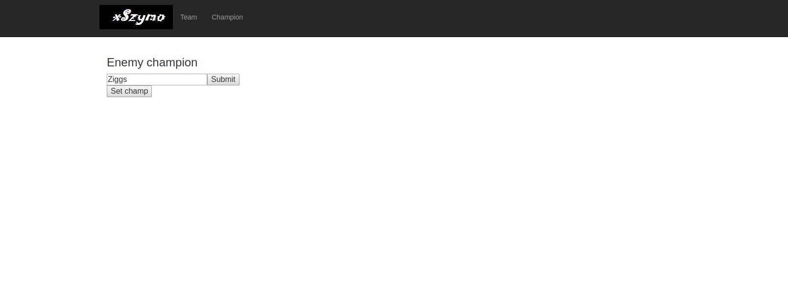
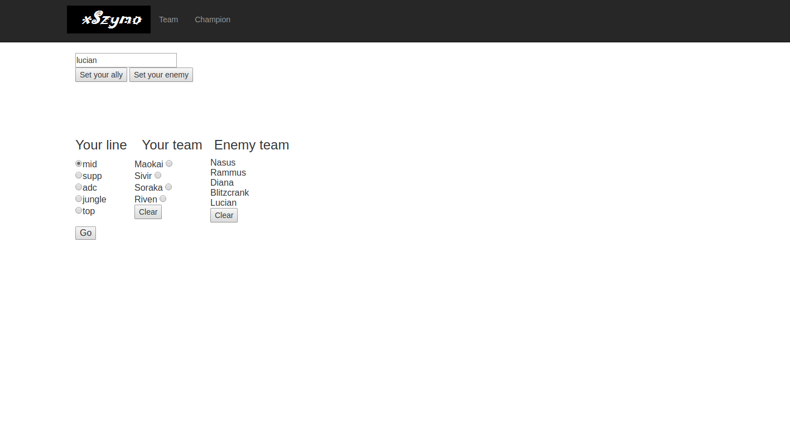

##Since riot api does not exist anymore the project cannot be used.

-------------------------------------------------------------------------------
 

####A simple web application which helps during league of legends games. Choose best champion for specific situations!

It used to look like this way :
- You could choose an enemy champion and after that the website would show tips and counters for that specific champion.
    

- Also You could set your allies and enemies, the algorithm would dedicate what champions would suit better for current team comp.
    

 

How to run :
1. install docker
2. docker run -it --rm -p 8080:8080 --name counters supermon/lolcounters
    

-------------------------------------------------------------------------------
bootstrap author : Blackrock Digital 
link : https://github.com/BlackrockDigital/startbootstrap-logo-nav 
counters source : http://how2win.pl/ 
